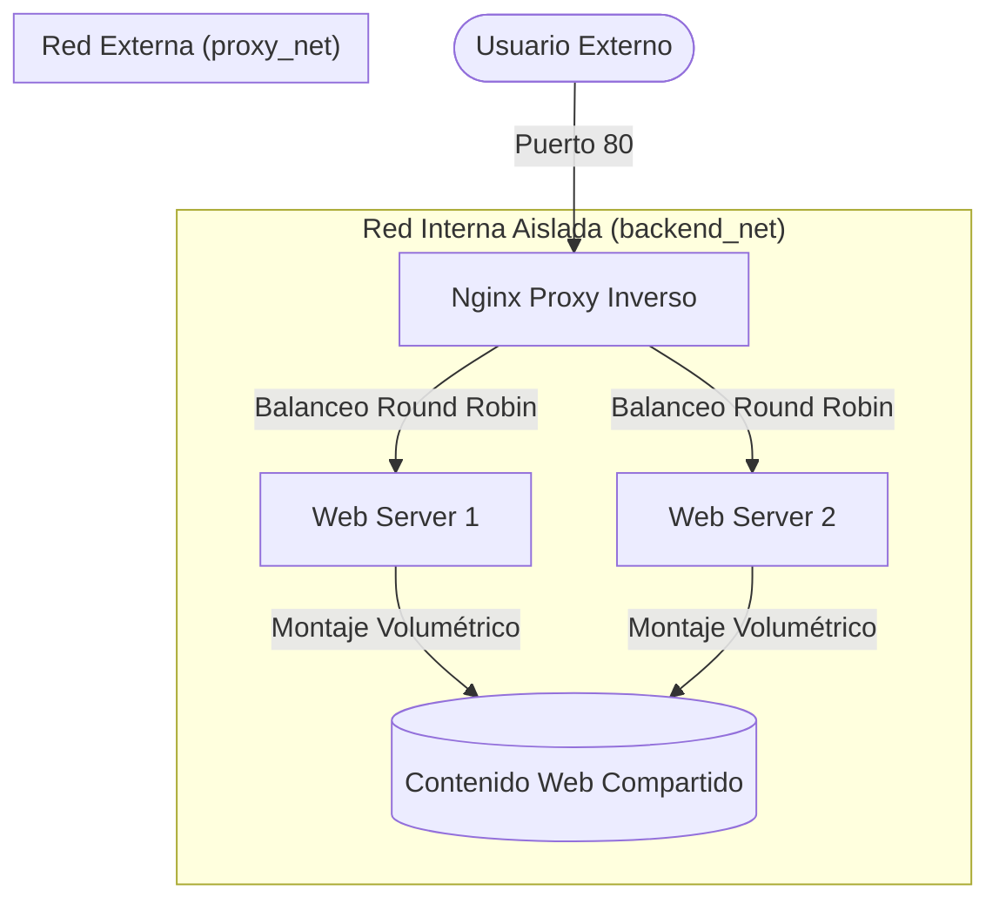

# Infraestructura de Balanceo de Carga con Docker

Este proyecto despliega una arquitectura web de alta disponibilidad utilizando Docker y Nginx como proxy inverso para balancear la carga entre dos servidores de backend.

## 🏗️ Esquema de la Arquitectura



## 🖼️ Elección de las Imágenes

Para este proyecto se ha seleccionado la imagen oficial de **Nginx (`nginx:latest`)** por las siguientes razones:

1.  **Rendimiento**: Extremadamente eficiente en el manejo de conexiones simultáneas y bajo consumo de recursos.
2.  **Versatilidad**: Funciona perfectamente tanto como **Proxy Inverso** (con capacidades de balanceo de carga nativas) como **Servidor Web** de contenido estático.
3.  **Configuración**: Su sintaxis es clara y permite añadir cabeceras personalizadas (`add_header`) de forma sencilla para el seguimiento de peticiones.
4.  **Estándar de la Industria**: Es la opción más robusta y documentada para entornos de producción.

## 🌐 Estructura de Red

La infraestructura utiliza un modelo de doble red para garantizar la seguridad:

*   **`proxy_net`**: Red pública (o expuesta al host) donde reside el proxy inverso. Es el único punto de entrada desde el exterior.
*   **`backend_net`**: Red configurada como `internal: true`. Esto significa que los servidores backend pueden comunicarse con el proxy, pero **no tienen acceso directo a la red externa** ni pueden ser contactados directamente desde fuera del entorno Docker.

## 🛠️ Comandos Necesarios

### Levantar el entorno
Para desplegar toda la infraestructura en segundo plano:
```powershell
docker-compose up -d
```

### Verificar el estado
Comprobar que los contenedores están en ejecución:
```powershell
docker-compose ps
```

### Verificar el Balanceo y Cabeceras
Ejecuta el siguiente comando varias veces para ver cómo cambia la IP del backend en la cabecera `X-Served-By`:
```powershell
curl.exe -I http://localhost
```

### Ver logs en tiempo real
Para monitorizar el tráfico que llega al proxy:
```powershell
docker-compose logs -f nginx-proxy
```

## 📁 Estructura del Proyecto
- `docker-compose.yml`: Orquestación de servicios y redes.
- `nginx-proxy.conf`: Configuración del balanceo y cabeceras.
- `web/`: Carpeta compartida con el código HTML.
- `web/imagenes/`: Almacén de contenido multimedia (imágenes y vídeo).

## 🧪 Verificaciones (Extraído de "Verificación Capturas")

### 1. Contenedores en ejecución
Se verifica el estado de los servicios y el mapeo de puertos:

```text
NAME           IMAGE          COMMAND                  SERVICE        CREATED          STATUS          PORTS
nginx-proxy    nginx:latest   "/docker-entrypoint.…"   nginx-proxy    11 minutes ago   Up 11 minutes   0.0.0.0:80->80/tcp, [::]:80->80/tcp
web-server-1   nginx:latest   "/docker-entrypoint.…"   web-server-1   11 minutes ago   Up 11 minutes   80/tcp
web-server-2   nginx:latest   "/docker-entrypoint.…"   web-server-2   11 minutes ago   Up 11 minutes   80/tcp
```

### 2. Balanceo de carga
El tráfico se distribuye correctamente entre los backends:
- **172.21.0.2:80** → `web-server-1`
- **172.21.0.3:80** → `web-server-2`

**Prueba de cabeceras:**
```text
C:\Users\Izan\Desktop\docker24-4>curl.exe -I http://localhost
HTTP/1.1 200 OK
...
X-Served-By: 172.21.0.2:80

C:\Users\Izan\Desktop\docker24-4>curl.exe -I http://localhost
HTTP/1.1 200 OK
...
X-Served-By: 172.21.0.3:80
```

### 3. Logs de los Backends
Se confirma que ambos servidores están recibiendo y procesando peticiones:
- **web-server-1**: Funcionando y registrando tráfico.
- **web-server-2**: Funcionando y registrando tráfico.

### 4. Red Aislada
Línea clave: **“Internal”: true**. Los contenedores pueden hablar entre sí pero Docker prohíbe el tráfico de salida hacia el exterior.

```text
C:\Users\Izan\Desktop\docker24-4>docker network inspect docker24-4_backend_net
[
    {
        "Name": "docker24-4_backend_net",
        "Internal": true,
        ...
    }
]
```

**Prueba de aislamiento (Host -> Backend):**
Al intentar un `curl` directo desde el host a los servidores backend, se produce un **TIMEOUT**, confirmando que el host no sabe cómo llegar a la subred privada del backend.

### 5. Acceso via Proxy
Se verifica que el proxy tiene visibilidad total de los backends:
- Conexión a **web-server-1** vía Proxy: OK
- Conexión a **web-server-2** vía Proxy: OK
